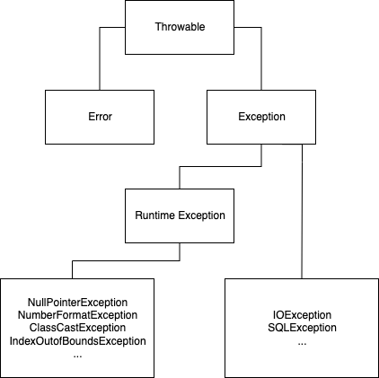
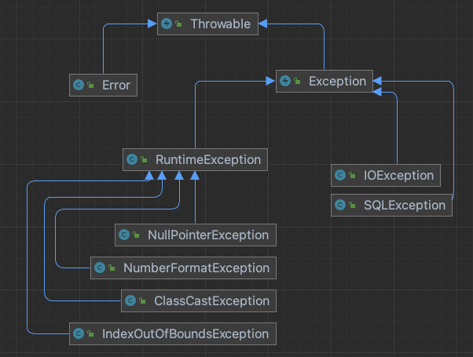

# Part 14: 예외라는 중요한 것이 있어요

### 개요

자바의 예외에 대해서 알아봅니다.

---

### 예외를 처리하는 방법

- 자바에서는 프로세스 내에서 예상치 못한 문제가 발생하게 되면 예외를 발생시켜 사용자에게 알려줍니다.
    - 우리가 앞서 확인했던 NullPointerException, ArrayIndexOutOfBoundsException 모두 예외입니다.
    - 그렇다면 이런 예외는 어떻게 핸들링해야 할까요?
- try-catch
    - try문에는 예외가 발생할 가능성이 있는 문장을 넣고 catch문에는 예외에 대처하는 복구 로직을 작성합니다.
        - 예외가 발생하고 그것을 catch로 잡아내는 것은 매우 긍정적입니다. 하지만 예외에 적절한 복구 로직을 작성하는 것이 매우 중요합니다.
        - catch문에 에러이라도 한다면 그나마 다행입니다. 출력도 수행하지 않는 catch문은 시스템에 예외를 반복해서 누적시킵니다. 이는 추후 큰 장애로 이어질 수 있으니 반드시 주의해야 합니다.
        - 자바는 일반적으로 엔터프라이즈 서버 환경을 구성하기 위해 사용됩니다. 서버 환경에서 에러를 단순히 콘솔 로그에 출력하는 것이 항상 모니터링하지 않는 이상 발견하기도 어렵고 묻히기도 쉽습니다. 따라서 catch문에는 예외 출력이 아닌 예외를 복구할 수 있는 로직을 작성해야 합니다.
        - 예외를 핸들링하는 핵심 원칙은 **모든 예외는 적절하게 복구되든지 아니먄 작업 중단 후 보고되어야 하는 것**입니다.
    - 예외가 발생한 라인 이후의 블록은 실행되지 않으며 바로 catch문의 로직이 수행됩니다.
    - 예외가 발생하지 않는 경우 try문 블록이 정상적으로 실행되고 catch문은 실행되지 않습니다.
    - 다수 개의 catch문도 가능합니다.
        - catch 블록의 순서는 상속 관계가 자식에서 부모 방향으로 넓어지도록 작성되어야 합니다.
        - 만약 앞 순서에서 부모 예외 클래스를 선언해 처리하는 예외의 범위가 넓어지면 하위 순서에게는 처리할 기회가 사라지게 됩니다. 즉 필요없는 문장이 되기 때문에 컴파일러는 `java: exception {블록에 명시한 예외 클래스} has already been caught`를 발생시킵니다.
- finally
    - 예외의 발생 여부와 관계없이 항상 실행되는 구문입니다.

---

### 예외의 종류

- 자바에서 예외는 Error, Checked Exception, Runtime Exception(Unchecked Exception) 세 가지로 나눠집니다.
    - 예외 클래스 하이라키
        
        
        

	

        
    - Error와 Exception은 발생의 발원지에 따라 구분됩니다.
        - Error는 자바 프로그램 밖에서 발생한 예외로 주로 JVM에서 발생시키고 **자바 프로세스**에 영향을 줍니다. 예를 들어 하드웨어의 고장, 메인보드의 고장이 있습니다.
        - Error는 애플리케이션 코드에서 잡으려고 해선 안됩니다. 시스템 레벨의 작업을 진행하지 않는 이상 애플리케이션에서 크게 핸들링에 신경 쓸 필요는 없습니다.
        - Exception은 프로그램 안에서 발생합니다. 즉 프로그램을 실행시키는 쓰레드에서 발생합니다.
        - Exception은 **쓰레드**에 영향을 줍니다. 예외가 발생할 때 스택 트레이스를 발견할 수 있는 것도 이 때문입니다.
    - Runtime Exception(Unchecked Exception)
        - 런타임 예외는 언체크 예외라고도 불립니다. 여기서 check는 ‘컴파일 타임 시점에서의 문제 확인’입니다.
        - 즉 컴파일 타임 시점에서 체크되지 않은 예외들을 우린 런타임 예외라고 합니다. 이 예외들은 예상하지 못한 케이스이기 때문에 위에서 말한 try, catch문처럼 예외를 복구하기 위한 로직을 미리 작성할 수 없습니다.
    - Checked Exception
        - 체크드 예외는 앞서 말한 런타임 예외와 달리 컴파일 타임에서 문제가 발생할 가능성을 이미 파악한 예외들을 의미합니다. 따라서 반드시 try-catch문이나 throws 를 통해 예외 복구 로직을 작성해야 합니다.
        - 런타임 예외를 제외한 모든 예외는 체크드 예외입니다.
        - 초기 자바에는 대부분의 예외가 체크 예외였습니다.하지만 최근에는 예외처리를 강제하는 점때문에 발생하는 예외 블랙홀 혹은 무책임한 throw문때문에 가능한 런타임 예외로 만드는 경향이 있습니다.

---

### Throwable

- 모든 예외의 (Object를 제외한) 최상위 클래스는 java.lang.Throwable 입니다.
    - Throwable에서 제공하는 메서드 중 자주 사용되는 메서드를 알아봅시다.
        - getMessage(): 발생한 예외 메시지를 String 형태로 전달받습니다.
        - toString(): getMessage()과 동일하게 동작하지면 발생한 예외 클래스 이름이 포함되어 좀더 자세하게 노출됩니다.
        - printStckTrace(): 발생한 예외의 메시지와 예외 스택 트레이스를 출력해줍니다.
- throw로 예외 발생시키기
    - 사용자는 비즈니스 로직에 알맞지 않은 케이스가 발생했을 때 임의로 예외를 발생시킬 수 있습니다. 이 때 사용하는 키워드가 바로 throw입니다.
    - 이 경우 개발자가 예외 상황을 충분히 설명하는 예외 클래스를 정의해 발생시킬 수 있습니다.
- throws를 통한 예외처리 회피
    - 지금까지는 try-catch-finally문을 통해 직접 예외를 복구했습니다.
    - 하지만 예외를 처리하는 것이 자신의 책임이 아닌 경우 자신을 호출한 메서드로 예외처리를 올려보낼 수도 있습니다. 이 때 사용하는 키워드가 바로 throws 입니다.
    - thorws된 예외를 다시 throws하는 무책임한 예외처리 회피는 권장되지 않습니다. 예외를 전달받았다면 try-catch문을 통해 적절하게 처리해야 합니다.

---

### 예외 클래스 정의하기

- 만약 자바에서 정의한 예외 클래스 중 현재 상황을 적절하게 설명해주는 예외가 없다면 직접 정의할 수 있습니다.
    - Throwable 혹은 Throwable의 자식 클래스를 상속받아 정의하면 됩니다.
    - 예외의 발생 시점이 런타임일 확률이 높고 이를 적절하게 처리할 수 있다면 RuntimeException을 상속해 런타임 예외로 만드는 것이 좋습니다.
        - Exception 클래스를 상속한 경우 체크 예외입니다.