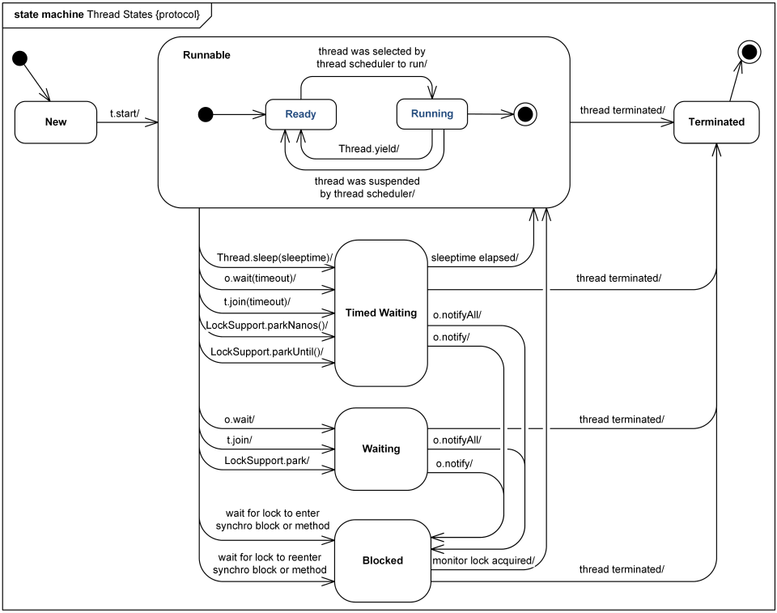

# Part 25: 쓰레드는 개발자라면 알아두는 것이 좋아요

### 개요

자바의 쓰레드에 대해서 알아봅니다. 웹 애플리케이션의 동작 구조에서 쓰레드의 역할은 정말 중요합니다.

---

### 쓰레드란?

- 쓰레드란 프로세스 내에서 명령을 수행하는 부하라고 생각하면 됩니다.
    - 프로세스는 반드시 하나 이상의 쓰레드를 가지지만, 쓰레드가 여러 프로세스에 의해 공유되진 않습니다.
        
        <p align="center"></p>
        
    - 프로세스는 프로그램이 메모리에 올라간 상태를 말합니다.
        - Process is program in execution
        - *운영체제는 메모리에 프로그램을 어떻게 올릴까?*
        - *프로세스 내에서 쓰레드는 어떻게 생성될까?*
- 쓰레드가 필요한 이유는 무엇일까요?
    - 하드웨어에서 기술 발전의 이유를 살펴보면 대부분 **자원의 효율적인 활용을 위해서** 입니다.
    - JVM에서 하나의 프로세스를 생성하기 위해서 일반적으로 32~64MB의 물리 메모리를 점유한다고 합니다. 하지만 쓰레드는 하나당 1MB 이내의 메모리를 사용하기 때문에 보다 효율적인 자원 사용이 가능합니다.
        - 서버 환경에서 클라이언트 요청을 처리하는 기술은 자원을 효율적으로 사용하도록 CGI Program→ Java Servlet 순서로 발전했습니다.
        - CGI 프로그램은 클라이언트의 요청이 새로운 프로세스를 통해 처리하는데 이는 자원 소모가 너무 큽니다. 반면 서블릿은 하나의 프로세스 안에서 여러 쓰레드를 생성해 요청을 처리하기 때문에 **프로세스 생성에 필요한 자원 - 쓰레드 생성에 필요한 자원** 만큼을 절약할 수 있습니다.

---

### Runnable Interfcae, Thread Class

- Runnable 인터페이스를 구현하거나 Thread 클래스를 상속해 쓰레드 생성이 가능합니다.
    - 왜 두 가지 방법이 존재할까요?
        - 만약 Thread 클래스만 존재한다면 다중 상속이 불가능하기 때문에 부모 클래스를 확장하는 클래스는 쓰레드를 생성할 수 없어집니다. 따라서 이를 극복하기 위해 Runnable 인터페이스를 제공하고 있습니다.
    - start() 메서드를 통해 쓰레드가 코드를 수행하도록 명령할 수 있습니다.
        - start()는 스레드가 실행을 시작하게 하는 메서드로써 JVM은 start()가 호출될 때 스레드의 run() 메서드를 호출합니다.
        - 결과적으로 Thread의 start()을 호출한 current 메서드와 run() 메서드를 실행하는 other 메서드, 두 개의 스레드를 동시에 시작합니다. 한 번 이상 start()하는 것은 허용되지 않습니다. 특히 스레드가 실행을 완료한 뒤엔 스레드가 다시 실행되지 않을수도 있습니다.
        - start()는 VM이 생성하거나 설정한 메인 메서드 스레드나 시스템 그룹 스레드들에는 호출되지 않습니다.
        - start() 메서드는 네이티브 start0() 을 호출하는데, start0() 메서드는 JNI를 통해 OS System call을 호출합니다. 운영체제가 리눅스라면 clone이라는 시스템 콜을 호출하고 이 때 OS 레벨의 스레드를 새롭게 생성하게 됩니다. 이렇게 **생성된 OS 스레드는 자바에서 생성한 사용자 스레드와 일대일로 매핑되어 명령어를 수행**하게 됩니다.
        
        ```java
        public
        class Thread implements Runnable {
        
        /*
        		Causes this thread to begin execution; the Java Virtual Machine calls the run method of this thread.
        
        		The result is that two threads are running concurrently: the current thread (which returns from the call to the start method) and the other thread (which executes its run method).
        		It is never legal to start a thread more than once. In particular, a thread may not be restarted once it has completed execution.
        		
        		Throws: IllegalThreadStateException – if the thread was already started.
        		See Also: run(), stop()
        */ㄴ
        public synchronized void start() {
                /**
                 * This method is not invoked for the main method thread or "system"
                 * group threads created/set up by the VM. Any new functionality added
                 * to this method in the future may have to also be added to the VM.
                 *
                 * A zero status value corresponds to state "NEW".
                 */
                if (threadStatus != 0)
                    throw new IllegalThreadStateException();
        
                /* Notify the group that this thread is about to be started
                 * so that it can be added to the group's list of threads
                 * and the group's unstarted count can be decremented. */
                group.add(this);
        
                boolean started = false;
                try {
                    start0();
                    started = true;
                } finally {
                    try {
                        if (!started) {
                            group.threadStartFailed(this);
                        }
                    } catch (Throwable ignore) {
                        /* do nothing. If start0 threw a Throwable then
                          it will be passed up the call stack */
                    }
                }
            }
        ```
        
- 쓰레드도 이름이 있을까요?
    - 쓰레드에게 이름을 지정하지 않으면 쓰레드는 생성된 순서에 따라 ‘Thread-정수값’을 갖게 됩니다. 물론 지정할수도 있습니다.
- 여러 쓰레드들을 한 가지 목적을 위해 묶어놓을 수 있을까요?
    - ThreadGroup 클래스를 통해 할 수 있습니다. 이것이 왜 필요하고 어떤 메서드를 제공하는지는 조금 뒤에 알아보겠습니다.
    - Thread는 생성자의 stackSize 인자를 통해 스택의 크기를 임의로 지정할 수 있습니다.
        - 여기서 언급되는 스택은 ‘Stack Frame’을 의미합니다. JVM이 프로세스를 실행하면 할당받은 메모리는 여러 공간으로 분리되어 사용됩니다. 이 때 한 공간이 Runtime Data Aread인데요. 여기엔 명령어를 수행하는 쓰레드들이 여러개 생성됩니다. 각 쓰레드는 다른 쓰레드와 공유하지 않는 각자만의 스택(프레임을 담는 바구니)을 갖습니다. 이름처럼 스택 자료구조의 특성을 갖지만, 컬렉션 프레임워크에서 말하는 스택 자료구조는 아니라는 것을 기억하면 됩니다.

---

### 데몬 스레드와 비데몬 스레드, 우선순위

- Thread 클래스의 주요 메서드는 두 가지 성격을 갖습니다. 쓰레드의 내부 속성을 지정하고 확인하거나, 상태를 통제합니다.
    - 여기서 말하는 속성이란 이름, 우선 순위, 데몬-비데몬 여부를 의미합니다.
    - 상태란 ‘쓰레드의 움직임 순간 포착’입니다.
        - 모두 알다시피 CPU는 한번에 하나의 일만 수행합니다. 여러 개의 쓰레드가 실행될 때에도 마찬가지인데요. 물론 멀티코어라면 동시에 수행될 수 있겠지만 하나의 코어는 하나의 명령어만을 수행된다는 사실에는 변함이 없습니다.
        - 쓰레드가 어떤 행동을 하고 있느냐에 따라 열거형 클래스 State 클래스를 통해 쓰레드의 라이프사이클을 표시합니다. *`NEW,* *RUNNABLE,* *BLOCKED,* *WAITING,* *TIMED_WAITING,* *TERMINATED`* 가 있고 이 중 `*NEW, TERMINATED`* 를 제외한 4개가 상태에 해당됩니다.
- 언급했던 것처럼 쓰레드는 한번에 하나만 실행될 수 있기 때문에 CPU에 의해 실행되는 순서가 존재하며, 속성에 따라 **우선순위**도 존재합니다.
    - 우선순위는 `MIN_PRIORITY(1)`, `NORM_PRIORITY(5)`, `MAX_PRIORITY(10)`의 상수 형태로 존재하고 값이 클수록 우선순위가 높아집니다.
        - 디폴트 값을 유지하는 것이 권장됩니다.
- 쓰레드는 데몬 스레드와 비데몬 스레드로 나눠집니다. 우리가 일반적으로 main() 메서드를 통해 프로그램을 수행하는 스레드는 일반(비데몬) 스레드입니다.
    - 데몬 스레드의 라이프사이클은 동시에 수행되는 비데몬 스레드에 의존적입니다. 쉽게 말하자면 동시에 수행되는 다른 일반 스레드가 종료되면 멈춰 버립니다.
    - 데몬 스레드가 필요한 이유는 모니터링이나 GC와 같은 부가 작업을 하기 위해서입니다.

---

### synchronized

- synchronized는 스레드가 공유되는 자원을 사용할 때 막무가내로 접근하지 않도록 하기 위해서다. 짧게 말하자면 **성(자원)을 여러 침략자(스레드)로부터 온전하게 지키기 위해서**다.
    - 메서드 자체를 synchronized로 선언하는 방법(synchronized methods)과 특정 코드만 감싸는 방법(synchronized statements)이 있다.
        - 메서드 선언부에 synchronized가 선언되었다는 것은 메서드를 호출해서 수행할 수 있는 쓰레드의 수가 딱 1개라는 의미다.
        - 이 문제는 쓰레드가 공유하는 값의 상태를 변경될 때 발생한다. 예시로 작성한 계산기 프로그램에서 이러한 **race condition 문제가 발생**한다.
            
            ```java
            public class ModifyAmountThread extends Thread {
                private CommonCalculate calculate;
                private boolean addFlag;
            
                public ModifyAmountThread(CommonCalculate calculate, boolean addFlag){
                    this.calculate = calculate;
                    this.addFlag = addFlag;
                }
            
                public void run(){
                    for (int i = 0; i < 10000; i++) {
                        if(addFlag){
                            calculate.plus(1); // amount += 1
                        } else {
                            calculate.minus(1); // amount -= 1
                        }
                    }
                }
            
            		public static void main(String[] args) {
                    CommonCalculate calculate = new CommonCalculate();
            
                    ModifyAmountThread amountThread1 = new ModifyAmountThread(calculate,true);
                    ModifyAmountThread amountThread2 = new ModifyAmountThread(calculate,true);
            
                    amountThread1.start();
                    amountThread2.start();
            
                    try {
                        amountThread1.join();
                        amountThread2.join();
            
                        System.out.println(String.format("Final value is %s", calculate.getAmount())); // 20000보다 작은 값
                    } catch (InterruptedException e) {
                        e.printStackTrace();
                    }
                }		
            }
            ```
            
            | amoutThread1 |  | amoutThread2 |  |
            | --- | --- | --- | --- |
            | 현재 연산 | amount 값 | 현재 연산 | amount 값 |
            | amount+value | 1 |  |  |
            | 더하기 완료 | 1 | amount+value | 1 |
            | amount 변수에 할당 | 2 | 더하기 완료 | 1 |
            |  |  | amount 변수에 할당 | 2 |
            
            →궁극적으로 amount는 2번의 연산이 수행됐음에도 불구하고 1밖에 더해지지 않는다. `synchronized` 블록은 이 연산이 서로 종료된 이후 각각 수행되도록 제어한다.
            
- 하지만 이 경우 전체 메서드 라인이 실행 시 대기하게 된다. 이 경우는 위에서 말한 특정 영역만 synchronized 로 만드는 synchronized statements 방법을 사용하면 된다.
    - 이 때 쓰레드의 접근을 제어하는 대상이 다르다면 접근을 제어해주는 문지기 객체도 각각 생성해 사용해야한다. 문지기를 한명만 사용한다면 문지기가 관리하는 synchronized 블록을 모두 제한하기 때문이다.

---

### 쓰레드를 통제하는 메서드들

<p align="center"></p>

[https://www.uml-diagrams.org/java-thread-uml-state-machine-diagram-example.html](https://www.uml-diagrams.org/java-thread-uml-state-machine-diagram-example.html)

- `getState()`
    - 쓰레드는 최초 생성되어 실행되기 전의 `NEW`, 종료된 `TERMINATED` 외에 4개의 상태가 있습니다. 이런 쓰레드의 상태를 확인하기 위한 메서드입니다.
- `join()`
    - 명령어를 실행하고 있는 쓰레드가 동작을 완료할 때까지 대기하도록 만드는 메서드입니다.
        - 예를 들어 택배를 발송하는 과정을 예시로 들어보겠습니다.
            
            ```java
            public class SendPost {
            		public static void main(String[] args) {
            				System.out.println("LH 택배에 오신 것을 환영합니다");
            				
            				WrappingThread wrappingThread = new WrappingThread();
            				wrappingThread.start(); // run()에는 택배를 포장하는 코드가 있다고 가정
            				
            				sendPost(); // 택배를 전송하는 메서드
            		}
            }
            ```
            
        - 위 코드에서 WrappingThread 클래스가 포장 작업을 완료할 때까지 sendPost() 메서드가 실행되서는 안됩니다. 포장도 안하고 보낼수는 없으니까요.
        - 이 때 “WrappingThread의 동작이 완료될 때까지 기다려!” 라고 메인 스레드한테 말해줘야 하겠죠. 이 때 사용되는 메서드가 바로 join()입니다.
            
            ```java
            public class SendPost {
            		public static void main(String[] args) {
            				System.out.println("LH 택배에 오신 것을 환영합니다");
            				
            				WrappingThread wrappingThread = new WrappingThread();
            				wrappingThread.start(); // run()에는 택배를 포장하는 코드가 있다고 가정
            
            				System.out.println("포장 작업중! 기다려주세요!");
            				wrappingThread.join();
            
            				sendPost(); // 택배를 전송하는 메서드
            		}
            }
            ```
            
- `interrupt()`
    - 수행중인 쓰레드에 정지 요청을 하는 메서드입니다. 위 메서드를 수행하면 `InterruptedException` 을 발생시키며 쓰레드를 중단시킵니다.
- `checkAccess()`
    - 수행중인 쓰레드가 자신을 수정할 수 있는 권한이 존재하는지 확인합니다.
- `isAlive()`
    - 쓰레드가 현재 살아있는지를 확인합니다.
- `isInterrupted()`
    - run() 메서드의 정상적인 종료가 아닌 `interrupt()` 메서드 호출로 인해 종료되었는지를 확인합니다.
- `interrupted()`
    - 현재 쓰레드가 중지된 상태인지를 확인합니다.
- `activeCount()`
    - 현재 쓰레드가 속한 쓰레드 그룹에서 살아있는 쓰레드가 몇 개인지 반환합니다.
- `currentThread()`
    - 현재 수행중인 쓰레드 객체를 반환합니다.
- `dumpStack()`
    - 콘솔 창에 현재 쓰레드의 스택 정보를 출력합니다.

---

### Thread 클래스에서만 쓰레드를 통제하진 않습니다. Object 클래스에서도 가능해요.

- `wait()`
    - 쓰레드를 대기 상태로 만드는 메서드입니다. notify(), notifyAll() 메서드를 통해 대기 상태를 해지할 수 있습니다.
- `notify()`
    - Object 객체 모니터에 대기하고 있는 단일 쓰레드를 깨웁니다.
        - race condition에서 critical section에 대한 접근을 제어하기 위한 여러 가지 메커니즘이 존재합니다. 그 중 조건에 따라 스핀락, 뮤텍스, 세마포어 등으로 나눠지는데요. 멀티 프로그래밍 환경에서 다수개의 자원에 대해서 다수개의 프로세스 혹은 스레드가 접근할 때는 세마포어 방식을 사용합니다. 하지만 세마포어만으로는 프로그래밍 환경에서 완벽하게 제어하기가 어렵습니다. 이 때 이를 개선하는 도구가 ‘모니터’입니다.
        - 쉽게 말하자면 모니터는 이런 역할을 합니다. 객체에 접근하는 쓰레드들에게 “그래 네가 이거 먼저 써” 락(권한)을 부여하는 역할과 다른 쓰레드가 접근했을 때 “지금은 쓰는 사람 있어 안돼” 접근을 제어하는 역할, “지금은 누가 쓰고 있으니까 잠시 기다릴래?” 접근 순서를 기억하고 관리하는 역할을 합니다.
- `notifyAll()`
    - Object 객체의 모니터에 대기하고 있는 모든 쓰레드를 깨웁니다.

---

### 참고자료

- [PHP도 CGI 인가요?](https://kldp.org/node/73386)
- [스레드 종류가 참 많죠?](https://www.youtube.com/watch?v=vorIqiLM7jc)