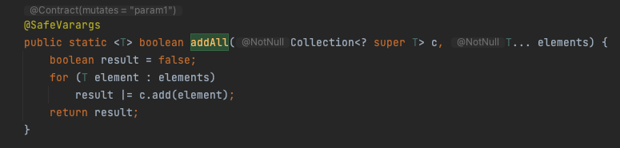

# Part 30. Java 7에서 달라진 것들에는?

### 개요

Java 6까지 사용했던 기능에서 Java 7에서 어떤 점들이 달라졌는지 알아봅니다.

---

### 달라진 숫자 표현법

- 기존 정수형 표현 시에는 8,16진수의 경우 0,0x 접두사를 붙혀 표현했습니다. Java 7부터는 0b를 통해 2진수도 표현할 수 있습니다.
- 일반적으로 돈, 큰 범위의 숫자를 표현할 때는 ‘,’ 기호를 통해 1000 단위를 구분합니다. Java 7부터는 ‘_’를 통해 천단위를 구분할 수 있습니다.
    - 숫자 사이만 가능합니다.

---

### 다이아몬드를 사용하는 제네릭

- 제네릭을 사용하더라도 이전까지는 생성자에 타입을 명시적으로 작성해줘야 했습니다. 하지만 Java 7부터는 변수 선언 시 타입을 명시했다면 생성자에선 생략이 가능합니다.
    - 다만 마이아몬드를 지정하지 않은 경우 컴파일 경고가 발생합니다.
- 제네릭 사용 시 reifiable하지 않은 varargs 타입 문제가 발생합니다.
    - ‘reifiable하지 않은’ 의 의미는 런타임에서 타입이 구체화되지 않는다는 것을 의미합니다.
    - @SafeVarargs 어노테이션을 메서드 선언부에 추가해 해결할 수 있습니다.
        
	

        
        - 다만 가변 매개 변수를 사용하거나 final, static으로 선언되어 있어야 합니다.
        - 만약 가변 매개 변수가 reifiable 타입이거나 메서드 내의 매개변수를 다른 변수에 대입하는 작업이 존재하는 경우 컴파일 경고가 발생합니다.

---

### 예외 처리의 보완

- 지금까진 체크 예외가 발생 가능한 메서드를 호출하는 경우 try-catch 블록에 코드를 작성하고 예외를 catch로 잡아냈습니다. 이 때 만약 발생 가능한 예외가 여러 종류일 경우 catch문을 예외마다 작성해나가야 했습니다. 하지만 java 7부터는 예외를 처리하는 코드가 같은 경우 ‘|’ 기호를 통해 여러 예외 클래스를 명시할 수 있습니다.
- 반드시 자원을 반환하고 이를 try 문장과 함께 사용하는 경우 이젠 ‘try-with-resource’를 사용할 수 있습니다.
    - Java 7부터는 `AutoCloseable` 인터페이스가 추가됐습니다. try-with-resource를 사용할 때 이 인터페이스를 구현한 클래스는 close()를 호출하지 않아도 close()가 자동으로 호출됩니다.
    - 기존 `Closeable` 인터페이스는 `AutoCloseable` 인터페이스를 상속하도록 변경됐습니다.